# SSB MCP ── Sharp Money Intelligence for AI Agents

<p align="center">
  <a href="https://github.com/jbdrak/ssb-for-agents/releases">
    
  </a>
  <a href="https://github.com/jbdrak/ssb-for-agents/actions/workflows/ci.yml">
    
  </a>
  
  <a href="LICENSE">
    
  </a>
</p>

SSB MCP is a Model Context Protocol server that lets AI agents see what the sharpest sportsbooks are doing. Its current registry covers 39 screen feeds across 12 league configs, detects coordinated sharp movement, surfaces steam moves and line lags, and explains the consensus — so you can decide what to bet, not be told.

Connect it to Claude Desktop, Cursor, Cline, Hermes, or any MCP client. Requires a [PropProfessor](https://propprofessor.com) account — the **free tier is enough**; no paid subscription needed.

> **Honest scope — no profitability claim:** SSB MCP is a sharp-signal DISCOVERY and RATING tool. `tier` / `kaiCall` / `edge` / `screenScore` are signal-quality ratings, not win-probability predictions. Profitability is UNPROVEN — no settled-results backtest has been published yet. Use it to find candidate plays and validate them yourself; do not treat outputs as a guaranteed winning system. The ranking pipeline surfaces _what sharp books are doing_; the betting decision stays with you.

## What this project demonstrates

- **Agent integration** — a 31-tool MCP surface with natural-language routing and structured responses
- **Data pipelines** — live odds extraction, line-history hydration, consensus scoring, and market-specific ranking
- **Operational reliability** — auth recovery, circuit breakers, caching, validation, and deterministic install checks
- **Honest evaluation** — synthetic validation is separated from real settled-results backtesting; unsupported win-rate claims are deliberately avoided

## 🚀 Overview

Your AI agent gets 31 tools that surface the same signal feed professional bettors use:

- **Screen & rank** — query the current 39-feed screen registry, ranked by consensus edge and movement
- **Detect sharp coordination** — Pinnacle, Circa, BookMaker, and BetOnline moving together? That's a signal
- **Explain the "why"** — every play comes with a human-readable rationale: _what moved, on which books, over what timeframe_
- **Natural language routing** — agents call `ask("best plays on Fliff tonight")` and get routed to the right tool automatically

The pipeline extracts odds, hydrates line history, ranks by movement quality + consensus strength, assigns a tier and risk score, and returns everything your agent needs to present an informed recommendation. The betting decision stays with the human.

## ⚡ Quickstart (30 seconds)

1. **Clone and install:** `git clone https://github.com/jbdrak/ssb-for-agents.git && cd ssb-for-agents && npm ci && npm link`
2. **Wire your MCP client** — pick your client below:

   **Claude Desktop** (`claude_desktop_config.json`):

   ```json
   {
     "mcpServers": {
       "ssb": {
         "command": "pp",
         "args": ["--mcp"]
       }
     }
   }
   ```

   **Cline** (`cline_mcp_settings.json`):

   ```json
   {
     "mcpServers": {
       "ssb": {
         "command": "pp",
         "args": ["--mcp"],
         "env": {}
       }
     }
   }
   ```

   **Cursor** — Settings → Features → MCP Servers → Add:

   ```
   Name: ssb
   Type: command
   Command: pp --mcp
   ```

   **Continue.dev** (`~/.continue/config.json`):

   ```json
   {
     "experimental": {
       "mcpServers": {
         "ssb": {
           "command": "pp",
           "args": ["--mcp"]
         }
       }
     }
   }
   ```

   **Hermes** (`~/.hermes/config.yaml`):

   ```yaml
   mcp_servers:
     ssb:
       command: pp
       args: [--mcp]
   ```

3. **Auth (one-time):** `node scripts/pp-login.js` — opens a browser for PropProfessor login and persists cookies for the server to use.
4. **Ask your agent:** _"What are tonight's sharpest plays on Fliff?"_

That's it — your agent now sees 31 tools.

> **Verify your install:** `npm run install:verify` runs the credential-free install verification suite.

## ⬆️ Upgrading from `propprofessor-mcp`

The project was renamed in 2.10.0. The old GitHub URL redirects, and nothing changed behaviorally — but a few consumer-visible identifiers moved. If you installed from source before the rename:

```bash
mv ~/.propprofessor ~/.ssb-for-agents   # move your auth/state (or just re-run `pp-query login`)
```

- **State directory:** `~/.propprofessor` → `~/.ssb-for-agents`. A `mv` preserves permissions; re-running `pp-query login` is the alternative.
- **Environment variables:** `PROPPROFESSOR_*` → `SSB_*`. The `PP_*` variables are unchanged.
- **Module paths (deep imports only):** `lib/propprofessor-*.js` → `lib/ssb-*.js`.
- **Binaries:** `ssb`, `ssb-mcp`, `ssb-query`, and `ssb-backtest` are the canonical names. The `pp`, `pp-mcp`, `pp-query`, and `pp-backtest` names still work and are unchanged.
- **Deliberately unchanged:** the upstream API hosts (`app.` / `backend.` / `screen.` / `slipgen.propprofessor.com`) and the `pp` / `PP_*` CLI and env names.

See [CHANGELOG.md](CHANGELOG.md) for the full breaking-change list.

### CLI — `ssb` (alias `pp`)

SSB ships with a fast, standalone CLI that calls handlers directly — no MCP server needed.

```bash
git clone https://github.com/jbdrak/ssb-for-agents.git
cd ssb-for-agents
npm ci
npm link
ssb scan mlb tennis -M supportive -n3
```

Run `ssb --help` for the live list. Every `ssb` command also answers to its `pp` alias.

| Command                       | Description                                                                                      |
| ----------------------------- | ------------------------------------------------------------------------------------------------ |
| `ssb scan [leagues...]`       | Find plays across leagues. `-M <movement>`, `--fast`, `--deep`, `-B` (BET only), `--record-scan` |
| `ssb validate <playId>`       | Validate a specific play                                                                         |
| `ssb game <gameId>`           | Full game details                                                                                |
| `ssb today`                   | Today's slate + pending picks                                                                    |
| `ssb card`                    | Today's bet slip (BETs across all markets, kickoff-sorted)                                       |
| `ssb rank <league>`           | Ranked plays for a league                                                                        |
| `ssb prices <gameId>`         | Compare prices across books                                                                      |
| `ssb links [leagues...]`      | Sportsbook event links from the EV feed                                                          |
| `ssb player <name>`           | Player context + injury/risk flags                                                               |
| `ssb wallets`                 | Top Polymarket wallets vs a book (bet/pass)                                                      |
| `ssb fantasy`                 | Fantasy optimizer props                                                                          |
| `ssb picks`                   | Recent pick history                                                                              |
| `ssb log <gameId>`            | Log a pick                                                                                       |
| `ssb record`                  | Official bets + P&L from the tracker ledger — `stats`, `review`, or `pending` (local, read-only) |
| `ssb record-card <card.json>` | Promote a reviewed decision card into the ledger                                                 |
| `ssb health`                  | Auth + backend health check                                                                      |
| `ssb --mcp`                   | Run as MCP stdio server                                                                          |

Companion binaries (each with a `pp-` alias): `ssb-mcp` (MCP stdio server), `ssb-query init` / `login` / `doctor` (setup + auth), `ssb-backtest`.

**MCP mode:** `ssb --mcp` runs as an MCP stdio server. Connect it to Claude Desktop,
Cursor, Cline, or any MCP client. Pass `--mode full` for the full 31-tool surface.

**Quick start (from a clone):** after `npm link`, run `ssb --mcp` to start the MCP server. No global package download is required.
**Development/clone setup:** use the full path — `node /path/to/scripts/ssb-mcp-server.js` — see [MCP Client Setup](#mcp-client-setup) below.

All commands support `-j`/`--json` for piping and `--no-color` for CI/Telegram output.

Example output (scan filtered by supportive movement):

```
MLB › Moneyline  (2)
  Houston Astros @ +127  |  TIER 1  ● BET
    1.9%  ·  clv +4¢  ·  mv supportive_bouncy  ·  5 books
    Chicago White Sox vs Houston Astros  Fri, Jul 24, 6:40 PM

Tennis › Total Games  (1)
  Under 21.5 @ -104  |  TIER 1  ● BET
    3.4%  ·  mv supportive_clean  ·  16 books
    Avanesyan vs Oliynykova  Fri, Jul 24, 7:00 AM
```

## 📊 Backtesting

SSB includes a backtest runner that prints settled-pick performance across any date range.

```bash
# Show last 30 days of settled picks
node scripts/backtest-runner.js --days 30

# Show a specific date range
node scripts/backtest-runner.js --from 2026-06-01 --to 2026-07-20

# Or use the installed binary
pp-backtest --days 30
```

The runner reads from `~/.ssb-for-agents/picks.json` — the same file used by `pp log` and `pp picks`. It shows total picks, settled records, win rate, P&L, and breakdowns by tier and league. It never fabricates ROI. If no settled picks exist in the range, it says so honestly.

## 📒 Record Keeping — legacy tracker migration

The local record ledger (`PP_RECORD_LEDGER`, default `~/.ssb-for-agents/tracker/ledger.json`) is the v2 source of truth for official bets. To import the old Python tracker's settled bets (`~/.ssb-for-agents/tracker/bets.json`) into the v2 ledger:

```bash
# Preview what would be imported (dry-run is the default — writes nothing)
node scripts/migrate-tracker.js

# Machine-readable preview
node scripts/migrate-tracker.js --json

# Actually migrate (backs up the destination ledger first)
node scripts/migrate-tracker.js --apply
```

Safety properties:

- **Dry-run by default** — `--apply` is required to write anything; `--dry-run` is explicit and conflicts with `--apply`.
- **`bets.json` is never overwritten** — it is read-only input, and the script refuses to run when the source and ledger paths resolve to the same file.
- **Timestamped backup** — before `--apply` writes, the existing destination ledger is copied to `ledger.json.bak-<timestamp>` (no backup is needed on first migration).
- **Idempotent** — legacy IDs are preserved, so re-running never double-counts.
- **No guessed dates** — legacy records carry no event date (only `loggedAt`/`settledAt`), so migrated bets get `eventDate: "unknown"` and can never appear in strict date-filtered reviews. The complete original record is preserved verbatim in each bet's `legacy` metadata, along with the legacy id, status, and P&L (`plUnits`).

### Active workflow — record, review, settle

The day-to-day recordkeeping loop is manual and local-only; nothing polls SSB in the background:

```bash
# 1. Record the scan — snapshots the scan + normalized candidates into the ledger
pp scan --record-scan

# 2. Promote reviewed decision cards (BET → official bet; LEAN/PASS update the candidate only)
pp record-card card.json
pp record-card --json '<payload>'          # inline card JSON (single card or array)

# 3. Review the ledger (local, read-only)
pp record stats    --date 2026-08-04 --json
pp record review   --date 2026-08-04
pp record pending  --date 2026-08-04

# 4. Capture the CLOSING price for candidates near their start (bounded, single pass)
node scripts/capture-close.js --live --window 30        # or: npm run capture:close -- --live
node scripts/capture-close.js --prices closes.json      # deterministic path, no network
node scripts/capture-close.js --audit                   # report record usability, capture nothing

# 5. Fetch real result data and settle the official bets against it
node scripts/fetch-results.js --date 2026-09-17 --leagues MLB,WNBA --out results.json
python3 scripts/flashscore-results.py --days 1 --out fs.json   # tennis (same-day only)
node scripts/fetch-results.js --date 2026-09-17 --flashscore fs.json --out tennis.json
node scripts/settle-record.js --results results.json --date 2026-09-17 --dry-run

# 6. Evaluate — hit rate with a confidence interval, ROI, and beat-the-close
npm run evaluate                       # or: node scripts/evaluate.js --json
```

### Evaluating a record, and what "no result" looks like

`npm run evaluate` answers two questions separately and refuses to blur them:

- **Did we win?** Hit rate with a 95% Wilson interval, stake-weighted ROI, split by
  tier / market / league / price bucket. Every bucket prints its sample size, and a
  bucket under 30 decided outcomes is flagged `insufficientSample` rather than shown
  as a result.
- **Did we beat the close?** Measured over recorded CANDIDATES, not just bets, so it
  uses the whole scan. This is the leading indicator: it needs far fewer observations
  than win rate before it means anything.

Two things it will not do. It never reports a 0 mean CLV when no close has been
captured — it reports `unmeasured`, because "we never looked" and "we broke even
against the close" are different claims. And it never counts a row whose price is a
probability display string (`'49.0%'`) into ROI; those are counted separately as
`unpricedRows`. On an empty ledger it says insufficient sample for everything instead
of printing zeros that read like results.

### The card gate

`pp card` now applies a price test and a volume cap (`--max-bets`, default 2;
`--min-ev`, default 2%; `--no-gate` to disable). A row is only a BET if the price
returns positive EV against the decision-time de-vigged fair probability, or beats the
sharp consensus edge by the same margin. A row with neither has no price evidence and
becomes a LEAN. Anything from a bucket with fewer than 30 decided bets is labelled
`UNPROVEN`, and `No plays on today's <league> card — all N BET(s) failed the price gate`
is a legitimate, expected output.

The reason is arithmetic: a -135 price needs 57.1% to break even, and the repo's own
docs score the tier that produced most of these plays at ~50-54% on outcomes. Movement
alone is a hypothesis, not a price argument — the close is what tests it.

### The close is not the decision price

The ledger records a candidate's `odds` at DECISION time — the price when the scan
ran. Closing line value is a comparison against the CLOSE, and `capture-close.js` is
the only producer of one; before it existed there was no close anywhere in the repo,
so every printed "CLV" was an open-to-current move rather than a close-relative
number. Two things about the close record are deliberate:

- **`closeIsPrice` is the load-bearing field.** For a NoVig-family book the structured `odds` field in the scan payload is a display string (`'49.0%'`), not a price — `lib/ssb-formatter.js` overwrites it via `oddsValueForDisplay`. A close that arrives in that shape is stored as `closeImpliedProbability` with `closeIsPrice: false` and `closeOdds: null`. It is never converted into an American price, because turning a one-sided implied probability into a price means inventing a de-vig.
- **`closeKind` is `'pregame'` or `'post_start'`.** A quote taken inside the post-start grace window is not a close, so it is labelled rather than silently treated as one.
- **A `candidateId` is never recomputed.** It is the decision-time identity `pp record-card` joins on; rehashing a row after adding a close would orphan every bet linked to it.
- **`--audit` reports, and never repairs.** It counts unusable rows by reason (`probability_not_price`, `missing_game_id`, `missing_start`, `missing_fair_probability`, `missing_capture_time`) so the gaps are visible instead of assumed absent.

Key properties:

- **`--record-scan` is manual only** — it records whenever you run `pp scan --record-scan`; there is no cron job or background poller hitting SSB on a schedule.
- **Only BET promotes** — `pp record-card` turns explicit `BET` cards into official bet records; `LEAN`/`PASS` update the candidate without creating a bet. Re-importing an already-recorded card is a no-op (idempotent).
- **`pp record` is local and read-only** — `stats`, `review`, and `pending` modes read the ledger with no network and no writes; `--date` filters by the America/Chicago calendar day of scheduled start, `--json` emits machine-readable output.
- **Settlement never calls SSB** — `scripts/settle-record.js` (and `lib/record-settlement`) contain no network code. You fetch results yourself (e.g. an ESPN scoreboard dump) and hand them over as a local JSON file; the script matches bets to final scores, computes P&L, and writes the ledger atomically. `--dry-run` reports without writing anything; `--force` re-settles bets that already have a settled status.
- **Results file provenance is required** — the results file must be an object with non-empty top-level `provider` and `sourceUrl` plus an `events` array; bare event arrays are no longer accepted. A same-ID event never settles on its ID alone: it must also match the bet's participants and fall inside the scheduled date window, and event-specific source URLs are kept only when the top-level provenance is valid. Missing provenance is a CLI usage error (the ledger is never touched), and library callers receive pending records with a precise reason instead of a settlement.
- **`PP_RECORD_LEDGER` overrides the ledger path** — every command above reads/writes `$PP_RECORD_LEDGER` when set, otherwise the default `~/.ssb-for-agents/tracker/ledger.json`.

### Offline record → settle → evaluate example

Run the complete lifecycle without credentials, network calls, or user-file writes:

```bash
node examples/record-settle-evaluate.js
```

The synthetic fixture records an immutable probability snapshot, promotes a reviewed card, settles it from supplied result data, and derives calibration from the v2 ledger. Its one-bet report is explicitly marked insufficient for accuracy or uplift claims. See [Project status and evaluation roadmap](docs/STATUS.md) for shipped capabilities and hard limits.

## 🏛 Architecture

SSB MCP follows a layered data pipeline:

### API Layer

- **SSB Backend** — authenticated REST API for live odds, line history, and fantasy data
- **ESPN Integration** — live scores for tennis time correction and game verification
- **X / Google News** — player context (injury news, tweets) for bet validation

### Ranking Pipeline (Node.js)

- **Extract** — parse raw odds payloads from the screen API, expand multi-book selections
- **Hydrate** — use SharpOdds as the primary movement-history source, with the authenticated PP history path as a fail-closed fallback; cache board/history reads within the bounded request
- **Rank** — score by consensus edge (% advantage over sharp consensus), CLV proxy (opening vs current line movement), and league-specific market priorities
- **Tier** — assign TIER 1–4 based on movement grade (green/yellow/red) × risk score (1–10) × sharp book confirmation, with hysteresis to prevent thrashing
- **Format** — output at three verbosity levels: `minimal` (plain English), `standard` (tier/edge/risk/rationale), `full` (raw movement data)

### MCP Server (stdio)

- **JSON-RPC over stdio** — standard MCP transport with Content-Length framing (NDJSON optional)
- **31 tools** — organized into situational, analytical, and research tiers
- **Server-side validation** — enforces input schemas at the server, not trusting the client
- **Categorized errors** — auth, backend, transport, validation, internal — each with structured recovery hints

### Data Flow

```mermaid
flowchart LR
    subgraph BOOKS["39 Screen Feeds"]
        B1[Pinnacle]
        B2[Circa]
        B3[BookMaker]
        B4[BetOnline]
        B5[NoVigApp]
        B6[Fliff]
        BN[...33 more]
    end

    API[PropProfessor API]

    subgraph PIPE["Ranking Pipeline"]
        E[Extract odds]
        H[Hydrate with line history]
        R[Rank by movement + consensus]
        T[Tier + risk score]
    end

    subgraph OUTPUT["31 MCP Tools"];
        QS[quick_screen]
        T[today]
        SB[smart_bet]
        VP[validate_play]
        ASK[ask]
        OTH[...25 more]
    end

    CLIENT[Your AI Agent<br/>Claude / Cursor / Cline / Hermes]

    BOOKS --> API --> PIPE --> OUTPUT --> CLIENT
    CLIENT -. "you decide what to bet" .- BOOKS
```



## 🛠 Getting Started

### Quick Start

```bash
git clone https://github.com/jbdrak/ssb-for-agents.git
cd ssb-for-agents
npm install
npm link
pp-query init          # auth + verification + config — all at once
```

`pp-query init` checks Node version, opens PropProfessor login if needed, runs `doctor`, and prints ready-to-paste MCP config for your client. Or do it step by step:

```bash
pp-query login         # browser login
pp-query doctor        # verify everything works
```

Requires a [PropProfessor](https://propprofessor.com) account — the free tier is sufficient. That's it — you're ready to connect your AI agent.

### MCP Client Setup

Add to your client's MCP config:

```json
{
  "mcpServers": {
    "ssb": {
      "command": "node",
      "args": ["/path/to/ssb-for-agents/scripts/ssb-mcp-server.js"],
      "env": {
        "SSB_MCP_NDJSON": "true",
        "AUTH_FILE": "/path/to/.ssb-for-agents/auth.json"
      }
    }
  }
}
```

Replace `/path/to/` with your actual install path (e.g. `/Users/you/projects/ssb-for-agents`). Supports Claude Desktop, Cursor, Cline, Zed, Continue.dev, Windsurf, and any other stdio-based MCP client. See each client's docs for where MCP config lives.

**For short-lived one-off sessions:**

Clone the repository, install dependencies, and point your client at the server script:

```json
{ "command": "node", "args": ["/path/to/ssb-for-agents/scripts/ssb-mcp-server.js"] }
```

Requires a local clone and a free PropProfessor account.

**For headless/CI environments (no Chrome):**

Set the `SSB_COOKIES` env var with your PropProfessor cookies exported as JSON. This bypasses the CDP/Chrome auth path entirely:

```json
{
  "mcpServers": {
    "ssb": {
      "command": "node",
      "args": ["/path/to/ssb-for-agents/scripts/ssb-mcp-server.js"],
      "env": {
        "SSB_COOKIES": "[{\"name\":\"__Secure-next-auth.session-token\",\"value\":\"...\",\"domain\":\".propprofessor.com\"}]"
      }
    }
  }
}
```

**Auth refresh fallbacks (optional).** When the server-to-server token fetch is gated by Vercel (HTTP 429), the server self-heals via a logged-in browser. Fallback order is `got-scraping` → **ego-browser** → **CDP**: the ego-browser fallback (named task space `pp-token-refresh`, created on first use, unless `SSB_EGO_TASK_SPACE` is set to a positive integer task-space id) is tried first; the CDP fallback runs only if ego-browser fails. The CDP endpoint defaults to `http://127.0.0.1:9222/json/version`; set `SSB_CDP_VERSION_URL` (e.g. `http://127.0.0.1:9333/json/version`) to use a different Chrome-for-Testing listener. Both fallbacks are on-demand only — no polling.

### Hermes Agent

If you use [Hermes Agent](https://github.com/NousResearch/hermes-agent):

```bash
make install          # register MCP server + install default config
```

Or manually: add `ssb` to your `mcp_servers` in config.yaml. The `get_started` tool provides on-demand workflow guidance.

### Sharp-money alerts

SSB is manual-only. There is no supported cron, scheduled workflow,
or background polling mode. Run `quick_screen` on demand when you want a fresh
result.

## 🎯 The Natural Language Flow

`ask` is a query router — it parses natural language and returns a suggested tool + args, but it does NOT execute the tool. Your agent calls `ask` to figure out what to do, then makes the actual call:

```
You:  "Tell me the best plays on Fliff tonight"
Agent: ask({ query: "best plays on Fliff tonight" })
       → { parsed: { book: "Fliff" }, suggestedTool: "quick_screen", suggestedArgs: { books: ["Fliff"] } }
Agent: quick_screen({ books: ["Fliff"] })
       → [ranked plays with odds, edge, tier, risk, rationale — all on Fliff]
```

| You say                              | Agent asks `ask` → then calls                           | Returns                              |
| ------------------------------------ | ------------------------------------------------------- | ------------------------------------ |
| "best plays on Novig"                | `ask` → `quick_screen(books=["NovigApp"])`              | Playable bets with player context    |
| "what should I bet today"            | `ask` → `quick_screen(mode="recommended")`              | TIER 1 & TIER 2 across major leagues |
| "Tatum over 29.5 points"             | `ask` → `player_context(player="Tatum", sport="NBA")`   | Injury/news risk check               |
| "show me MLB sharp plays"            | `ask` → `quick_screen(leagues=["MLB"], mode="sharp")`   | Multi-sharp consensus plays          |
| "line shop Celtics ML"               | `ask` → `find_best_price(league="NBA", market="ML", …)` | Best price across available books    |
| "validate that Warriors spread play" | `ask` → `validate_play(league="NBA", gameId="…", …)`    | BET/CONSIDER/PASS verdict            |

## 📊 Available Tools

### Quick Situational Checks

| Tool                  | What it does                                                                                                                   |
| --------------------- | ------------------------------------------------------------------------------------------------------------------------------ |
| `ask`                 | Parse natural language query into the right tool + args (router, does NOT execute — agent calls the suggested tool separately) |
| `today`               | One-call daily briefing: sharp slate + your pending picks + recent stats                                                       |
| `get_started`         | Returns recommended workflow for casual/intermediate/sharp users                                                               |
| `get_market_registry` | List available markets for a sport, with per-book market names (e.g. Soccer → Draw No Bet)                                     |
| `quick_screen`        | Best plays on any book with sharp consensus + player context                                                                   |
| `smart_bet`           | One-call: play details + validate_play verdict + best price + staking                                                          |
| `player_context`      | Injury/availability check on a specific player                                                                                 |
| `validate_play`       | One-call verdict: re-fetches odds, checks injury news, returns BET/CONSIDER/PASS + playId + drift detection                    |
| `mlb_game_context`    | Starting pitchers, park factor, hourly weather, lineup lock for an MLB game                                                    |
| `find_best_price`     | Line-shop across all books for the best execution price                                                                        |
| `health_status`       | Auth freshness and endpoint connectivity                                                                                       |

`get_market_registry` returns main-line markets in the markets field and exact player/pitcher prop names in the propMarkets field. `scan` and `quick_screen` accept `includeProps:true` to merge those prop markets into a scan. Prop scans are manual-only because they increase backend fan-out and rate-limit risk.

### Deeper Signal Analysis

| Tool              | What it does                                                                         |
| ----------------- | ------------------------------------------------------------------------------------ |
| `sharp_consensus` | Multi-window (1h–48h) sharp movement — is the move sustained?                        |
| `screen_ranked`   | Full ranked data for a (league, market) pair with consensus and movement metadata    |
| `all_slates`      | Consolidated ranked list across multiple leagues in one call                         |
| `league_presets`  | Sport-specific ranking weights and sharp-book reference sets                         |
| `get_alerts`      | Line movement and steam move alerts since last check                                 |
| `ev_candidates`   | Fast +EV discovery — validate on `/screen` afterward                                 |
| `ufc_card`        | UFC card shortlist with official plays, best looks, and pass notes                   |
| `smart_money`     | Sharp action $ volume + per-side odds range per game (the signal the +EV feed hides) |

### Research & Bet Management

| Tool                                  | What it does                                                                    |
| ------------------------------------- | ------------------------------------------------------------------------------- |
| `get_play_details`                    | Line history for specific game IDs                                              |
| `staking_plan`                        | Fractional Kelly sizing (TIER 1: 2%, TIER 2: 1% of bankroll)                    |
| `fantasy_optimizer`                   | DFS-style fantasy picks (PrizePicks, Underdog — requires Fantasy Optimizer sub) |
| `log_pick` / `resolve_pick`           | Track your own bet outcomes                                                     |
| `place_bet`                           | Validate + log a play in ONE call; returns a pickId for settlement              |
| `get_pick_history` / `get_pick_stats` | View logged bets and win rate / P&L                                             |
| `manage_hidden_bets`                  | Hide/unhide bets on the fantasy table                                           |
| `clear_score_timeline`                | Reset tier trajectory tracking for a fresh session                              |

### Output Tuning

Every tool accepts:

| Parameter   | Values                      | What it does                                                           |
| ----------- | --------------------------- | ---------------------------------------------------------------------- |
| `verbosity` | `minimal` `standard` `full` | Controls explanation depth and field output                            |
| `compact`   | `true` / `false`            | Strips line history and debug payloads — reduces response size by ~90% |
| `fields`    | `["game", "edge", "tier"]`  | Return only specified fields per row                                   |

`quick_screen` additionally accepts:

| Parameter         | Values                          | What it does                                                                                                                                                                                                                                                                                                                                          |
| ----------------- | ------------------------------- | ----------------------------------------------------------------------------------------------------------------------------------------------------------------------------------------------------------------------------------------------------------------------------------------------------------------------------------------------------- |
| `cardWindow`      | `today` `next` `all`            | Date filter. `today` = today's slate plus any next-day matches merged in (flagged via `nextDayMerged` in the response). `next` = tomorrow only. `all` = every upcoming match, no date filtering. Default `today`.                                                                                                                                     |
| `maxPlaysPerGame` | `1`–`50` (default `2`)          | Max plays shown per game in `minimal` verbosity (highest `screenScore` first). Raise it (e.g. `10`) for full coverage of a game without a second call. `standard`/`full` verbosity always return every candidate regardless of this value.                                                                                                            |
| `parseable`       | `true`/`false` (default `true`) | When `true`, `minimal` verbosity includes a structured `plays` array alongside the summary — agents get both. Set `false` for summary-only.                                                                                                                                                                                                           |
| `includeResearch` | `true`/`false` (default `true`) | Run player_context research on each returned play and attach `riskFlag` / `riskSummary` / `topTweet` in the `research` array. Research is scoped to the FINAL returned plays (post tier/kaiCall filter) and de-duplicated per game, so the `research` array always matches the plays you see — no full-slate payload blowup. Pass `false` to disable. |
| `researchLimit`   | `1`–`50` (default `50`)         | Max final plays to run research on. Bounds payload size on large scans.                                                                                                                                                                                                                                                                               |

> **Player research is ON by default** in `quick_screen` (pass `includeResearch: false` to disable). It's scoped to the final returned plays and de-duplicated per game, so `research` always maps 1:1 to what you got back. On a huge unfiltered scan, lower `researchLimit` or use `lite` if the response nears the transport cap.

> **`cardWindow` honesty:** when `today` is alive and next-day rows are merged, the response reports `cardWindow: "today"` (not tomorrow's date) plus `nextDayMerged: true` and `nextDayDate`. Earlier builds mislabeled this as tomorrow — that bug is fixed.

> **Tier consistency:** as of 2.8.x, `tierCache` is cleared at the start of every MCP screen call (`quick_screen`, `screen_ranked`, `validate_play`). A given play's tier is therefore stable within a call and recomputed fresh per call — no cross-call drift from stale hysteresis state.

> **`verbosity: minimal` returns a plain-English summary string WITH a structured `plays` array** — agents get both human-readable text and machine-parseable data in one call. Each play in the array includes `league`, `market`, `game`, `selection`, `odds`, `confidenceTier`, `edge`, `startCST`, `movementDisposition`, and `screenScore`.

### Tool Surface Modes

Set `SSB_MCP_MODE` at server boot to control how many tools the agent sees on `tools/list`:

| Mode   | Default | Tools exposed | Best for                                                                                                                                   |
| ------ | ------- | ------------- | ------------------------------------------------------------------------------------------------------------------------------------------ |
| `lite` | ✅ yes  | 15            | **Recommended for most users.** Covers the full workflow (discover → drill-down → validate → track) without overwhelming the tool catalog. |
| `full` | no      | 31            | Power users — every discovery, screen, research, and admin tool. More tools but more noise for the agent to reason about.                  |

Lite mode exposes: `ask`, `smart_bet`, `quick_screen`, `today`, `find_best_price`, `validate_play`, `get_play_details`, `player_context`, `log_pick`, `get_pick_history`, `resolve_pick`, `get_market_registry`, `place_bet`, `sharp_alerts`, `health_status`.

The `tools/list` response always includes a `_meta` block so agents can tell which mode is active:

```json
{
  "tools": [...],
  "_meta": { "mode": "full", "toolCount": 31, "liteToolCount": 15, "fullToolCount": 31 }
}
```

### Tool Categories

Every tool carries a `category` field that groups it by purpose — agents can use this to mentally cluster the surface rather than reading 29 individual descriptions:

| Category     | Count | Purpose                                          | Tools                                                                                               |
| ------------ | ----- | ------------------------------------------------ | --------------------------------------------------------------------------------------------------- |
| `discovery`  | 6     | Find plays (scout, multi-league, DFS, +EV)       | `all_slates`, `ask`, `ev_candidates`, `fantasy_optimizer`, `get_market_registry`, `sharp_consensus` |
| `screen`     | 5     | Score / rank plays for a target book             | `quick_screen`, `screen_ranked`, `smart_bet`, `staking_plan`, `ufc_card`                            |
| `drill_down` | 3     | Deep dive on a specific play                     | `find_best_price`, `get_play_details`, `validate_play`                                              |
| `research`   | 3     | Context data (player news, game weather, alerts) | `get_alerts`, `mlb_game_context`, `player_context`                                                  |
| `tracking`   | 4     | Personal bet log                                 | `get_pick_history`, `get_pick_stats`, `log_pick`, `resolve_pick`                                    |
| `admin`      | 2     | Bookkeeping (cache, hidden bets)                 | `clear_score_timeline`, `manage_hidden_bets`                                                        |
| `meta`       | 3     | Server info / workflow guides                    | `get_started`, `health_status`, `league_presets`                                                    |

### Canonical vs Deprecated Param Names

A handful of params accept both a clean canonical name and a legacy alias — every existing call site keeps working, and new code can use the cleaner names:

| Canonical (prefer) | Deprecated alias                                | Where                                                                                                             |
| ------------------ | ----------------------------------------------- | ----------------------------------------------------------------------------------------------------------------- |
| `live`             | `is_live`                                       | 13 tools — `is_live` is snake_case only on the MCP surface; the upstream backend still uses `is_live` on the wire |
| `gameIds`          | `game_ids`                                      | `get_play_details` only                                                                                           |
| `targetBooks`      | `book`, `books`, `targetBook`, `targetBooksCsv` | `quick_screen` — service layer's `resolveTargetBooks()` accepts all 5 names                                       |

Deprecated aliases are documented in each schema's `description` field and are normalized to the canonical key at dispatch time. No code change required for existing callers.

## 🧪 How the Ranking Works

The pipeline grades every play in 5 steps:

1. **Movement grade** — green (all sharp books aligned), yellow (some signals, some not), red (adverse)
2. **Risk score** (1–10) — weighted from movement quality, consensus count, CLV strength, execution quality, and freshness
3. **Tier assignment** — lookup table: green + low risk → TIER 1, green-yellow + moderate → TIER 2, yellow → TIER 3, red → TIER 4
4. **Hysteresis** — a play doesn't thrash between TIER 1 and TIER 3 on small odds changes; tier trajectory is smoothed
5. **Sharp cross-reference** — verifies target-book moves independently against non-target sharp books

**Tier system:**

| Tier       | Label       | Meaning                                                       | Stake              |
| ---------- | ----------- | ------------------------------------------------------------- | ------------------ |
| **TIER 1** | Lock        | Green movement, risk 1–3, BET call. All signals aligned.      | 2% of bankroll     |
| **TIER 2** | Value       | Yellow-green movement, risk 3–5, BET or CONSIDER. Solid play. | 1% of bankroll     |
| **TIER 3** | Speculative | Yellow movement, risk 5–7, usually CONSIDER.                  | Skip or 0.25% max  |
| **TIER 4** | Avoid       | Red movement, risk 7+, PASS call. Do not bet.                 | 0% — no exceptions |

Full methodology, weight tables, and the tier assignment lookup in [docs/METHODOLOGY.md](docs/METHODOLOGY.md). Backtesting results in [docs/BACKTESTING.md](docs/BACKTESTING.md).

## 🔌 Integrations

See [Quick Start](#quick-start) for Hermes Agent setup. The MCP is self-documenting — agents call `get_started` to discover the right workflow.

### Discord / Telegram Alerts

The [Positive EV Command Center](https://github.com/jbdrak/positive-ev-command-center) is a companion project that monitors SSB for high-EV slips and plays, then pushes them to Discord and Telegram in real-time. It uses the same auth session and API client.

### `pp-query` CLI

`pp-query` is a standalone CLI for one-off queries without an MCP client. Soccer is queried from the generic `Soccer` backend feed; named competitions are filtered by their `leagueName` (the same model used by the frontend):

```bash
pp-query screen --league NBA --market Moneyline
pp-query screen --league EPL --market "Total Goals"
pp-query screen --league Soccer --league-name EPL --market "Total Goals"
pp-query sharp-plays --leagues NBA,MLB --market Moneyline
pp-query login
pp-query doctor
```

## 📈 Validation methodology

**TL;DR:** The infrastructure is in place. Real outcome data hasn't accumulated yet.

Two paths to validate the signal:

**1. Synthetic engine validation** — runs generated scenarios (sharp_move,
stable_no_edge, adverse) through the full pipeline to confirm the tier system
actually differentiates quality:

```bash
node scripts/backtest-synthetic.js
```

**2. Real outcome backtest** — snapshot-based, since the PropProfessor API does
not serve historical settled results. Take a pre-game odds snapshot daily, then
resolve outcomes as games settle:

```bash
# capture today's recommended plays
node scripts/daily-snapshot.js
# after games settle, apply win/loss/push via CSV
node scripts/resolve-outcomes.js --csv results.csv
# compute P&L, ROI, Sharpe, max drawdown from resolved data
node scripts/backtest.js --metrics data/snapshots.jsonl
```

The pipeline (`daily-snapshot.js` → settle games → `resolve-outcomes.js` →
`backtest.js --metrics`) is built and tested (full deterministic pipeline suite
passes). What's missing: **real settled-results data**. The synthetic
tier-validation run shows a TIER 1 hit rate of **53.7% over N=873 simulated
samples** — these validate the ranking engine, they do NOT prove profitability.

> **Honesty:** tier/kaiCall/edge/screenScore are signal-quality ratings, not
> win-probability predictions. Profitability is UNPROVEN — no settled-results
> backtest has been published yet. The system surfaces what sharp books are
> doing; it doesn't come with a bundled historical results feed. Don't trust a
> win rate you can't trace to settled bets. See [docs/BACKTESTING.md](docs/BACKTESTING.md).

## 🔧 Troubleshooting

| Symptom                                      | Likely cause                                                 | Fix                                                                                                                                |
| -------------------------------------------- | ------------------------------------------------------------ | ---------------------------------------------------------------------------------------------------------------------------------- |
| **`AUTH_ERROR`** on every call               | Auth token expired or invalid                                | Run `pp-query login` to re-authenticate in the browser                                                                             |
| **`CIRCUIT_BREAKER_OPEN`**                   | Upstream API is down or rate-limited                         | Wait ~30s for the half-open retry; if persistent, run `pp-query doctor` to check backend health                                    |
| **`VALIDATION_ERROR`**                       | Wrong parameter name or type                                 | Use the canonical param names (e.g. `targetBooks`, not `book`). See [Deprecated Param Names](#canonical-vs-deprecated-param-names) |
| **Empty results from `quick_screen`**        | No sharp consensus plays on that book+league combo right now | Remove `kaiCall: ["BET"]` to see CONSIDER/PASS rows too. Try a different book or league                                            |
| **`scan` returns nothing**                   | Market name mismatch per league                              | Call `get_market_registry({ sport: "NBA" })` to discover the correct market names                                                  |
| **First `quick_screen` is slow (5–15s)**     | Multi-league fan-out cache is cold                           | Normal. Subsequent calls with identical args return <5ms from the response cache                                                   |
| **Some tools are missing from `tools/list`** | Server booted in lite mode                                   | Set `SSB_MCP_MODE=full` on startup, or use `pp --mcp --mode full`                                                                  |
| **`CIRCUIT_BREAKER_OPEN` persists**          | Circuit breaker threshold exceeded                           | Increase `SSB_CIRCUIT_BREAKER_THRESHOLD` (default 5) or timeout (default 30s). See [CONFIG.md](CONFIG.md)                          |
| **Debug logging needed**                     | —                                                            | Set `SSB_DEBUG=1` to see request/response traces on stderr                                                                         |

Still stuck? Run `pp-query doctor` and [open an issue](https://github.com/jbdrak/ssb-for-agents/issues) with the output.

## ❓ FAQ

**Does this tell me what to bet?** No. It surfaces what sharp books are doing. The betting decision is yours.

**Do I need a PropProfessor account?** Yes, and the **free account is enough**. Live data works on the free tier at [propprofessor.com](https://propprofessor.com) — no paid subscription required.

**What books does it cover?** The code currently registers 39 screen feeds across 12 league configs. Some entries are alternate or specialized feeds rather than distinct sportsbooks. Sharp cross-reference: Pinnacle, Circa, BookMaker, BetOnline.

**Is it free?** Code is MIT-licensed, and a free PropProfessor account covers the data. There is no paid tier of the MCP itself.

**Can I run it without an MCP client?** Yes — `pp doctor` is a standalone CLI.

**What if I find a bug?** Run `pp doctor` first, then [open an issue](https://github.com/jbdrak/ssb-for-agents/issues).

## ⭐ Support

This is free, MIT-licensed software. If it saves you time or makes you money:

- ⭐ Star the repo — helps others find it
- 🐛 [Open an issue](https://github.com/jbdrak/ssb-for-agents/issues) when you find a bug
- 💸 [Sponsor on GitHub](https://github.com/sponsors/jbdrak) — funds ongoing development

No paid tier. No upsell. The whole codebase is open and the priority is making it better for the people who use it.

## 🔧 For Maintainers

```bash
npm test              # full deterministic suite passes (no exact count — see check:claims)
npm run test:coverage # ~82% statements
npm run lint          # clean
npm run format:check  # clean (npm run format to fix)
npm run check:version # verifies package.json ↔ CHANGELOG
```

Release: push a `v*` tag → CI runs lint + tests on Node 20 + 22 → publishes to npm → creates the GitHub release.

## 📚 Docs Index

| Doc                                                                  | What it covers                                                                                                        |
| -------------------------------------------------------------------- | --------------------------------------------------------------------------------------------------------------------- |
| [README](README.md)                                                  | Quick start, auth, CLI reference, tool list, tuning, architecture                                                     |
| [CONFIG.md](CONFIG.md)                                               | Environment variables, book config, token compression                                                                 |
| [INSTALL.md](INSTALL.md)                                             | Install, first-run setup, MCP client wiring                                                                           |
| [CONTRIBUTING.md](CONTRIBUTING.md)                                   | How to add a tool, testing, PRs                                                                                       |
| [MAINTAINERS.md](MAINTAINERS.md)                                     | Release process, smoke tests                                                                                          |
| [docs/METHODOLOGY.md](docs/METHODOLOGY.md)                           | Full ranking math: movement grade → risk score → tier + hysteresis                                                    |
| [docs/BACKTESTING.md](docs/BACKTESTING.md)                           | Synthetic & real-outcome backtest methodology                                                                         |
| [docs/AGENT_PROMPT.md](docs/AGENT_PROMPT.md)                         | Full system prompt for AI agents using SSB                                                                            |
| [docs/agent-guide.md](docs/agent-guide.md)                           | 5 patterns every AI agent needs (cheat-sheet)                                                                         |
| [docs/RESPONSE_SHAPES.md](docs/RESPONSE_SHAPES.md)                   | JSON response shapes for all tools                                                                                    |
| [docs/HERMES_SKILL.md](docs/HERMES_SKILL.md)                         | Hermes Agent integration skill                                                                                        |
| [docs/PERFORMANCE.md](docs/PERFORMANCE.md)                           | Response size, latency benchmarks, token usage                                                                        |
| [docs/MARKET-BOOK-AVAILABILITY.md](docs/MARKET-BOOK-AVAILABILITY.md) | Which markets each book supports, per league                                                                          |
| [docs/RELEASES.md](docs/RELEASES.md)                                 | Historical "what's new" archive (frozen at v2.2.0); [CHANGELOG.md](CHANGELOG.md) is the authoritative version history |
| [llms.txt](llms.txt)                                                 | AI agent discovery file (compact overview for LLMs)                                                                   |

## 📝 License

[MIT](LICENSE). PropProfessor offers a free tier; this MCP is an unofficial client built by [James Drake](https://github.com/jbdrak), not affiliated with PropProfessor.
